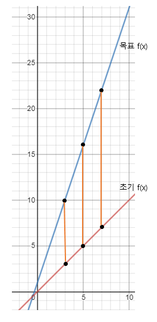
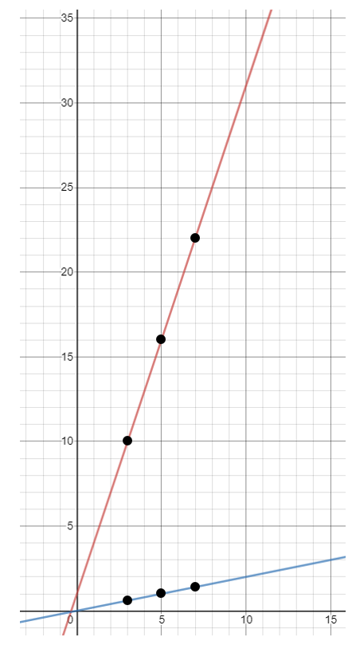
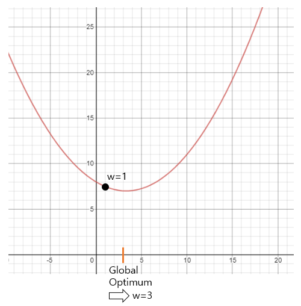
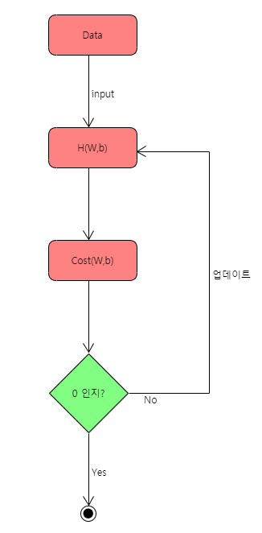
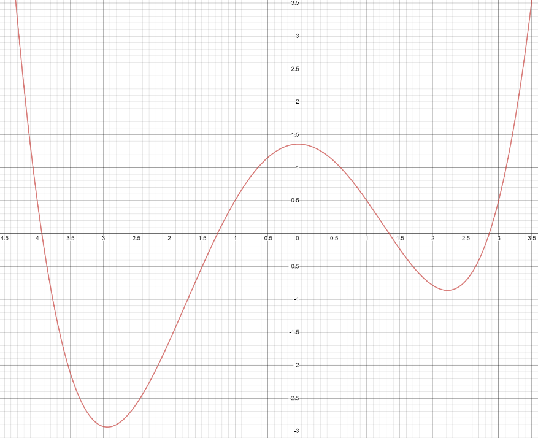

# Machine Learning Linear Regression의 원리 및 증명
_Last Updated: 2021-04-20_

## 목차 🧭
- 개요
- 선형회귀를 이용해, 미래의 값을 예측하기
- Cost가 최소가 되는 w, b 값을 구하기
- 경사하강법이 아닌, 직접 w, b 값 도출해내기
- 마치며

<br><br>

## 개요 🐶
<p align =center>

</p>

>제 4차 산업 혁명은 로봇 공학, 인공 지능, 나노 기술, 양자 프로그래밍, 생명 공학, IOT, 3D 인쇄 및 자율주행 차량을 비롯한 <br>
>여러 분야에서 새로운 기술 혁신이 나타나고 있습니다. <br><br>
>이번 세미나에서는 `선형회귀(Linear Regression)`기법을 활용한 미래의 값을 예측하는 원리와 그에 대한 증명을 수식으로 작성해 보았습니다.

통계학에서 <b>선형회귀</b>란 `종속 변수` Y와 한 개 이상의 `독립 변수(또는 설명 변수)` X 와의 선형 상관 관계를 모델링하는 회귀분석 기법입니다. <br>
<b>선형회귀</b>는 선형 예측 함수를 사용해 회귀식을 모델링 하는 기법이라고 할 수 있습니다.

<br><br>

## 선형회귀를 이용해, 미래의 값을 예측하기

`X는 날짜`, `Y는 가격` 이라고 정의하겠습니다. <br>
X=[3,5,7], Y=[10,16,22] 라고 가정했을 때, X=4 일때 Y(가격)는 얼마가 되어야 할까요?
<br><br>
인간의 눈으로 봤을 때는 $`f(x) = 3x + 1`$ 이라는 정답을 바로 도출해 낼 수 있습니다.<br>
<br>

***하지만, 컴퓨터는 그렇지 못합니다.***

<br>

먼저, X=4 일때의 가격(Y)을 예측해보기 위해서 `가설( H(w,b) )`을 정의하겠습니다. <br>

> H(w, b) = W*x + b (W는 기울기, b는 y절편)

컴퓨터는 먼저, W=1, b=0으로 가설을 초기화 하고 `목표 값(=정답 값)`으로부터 얼마나 잘못되었는가를 계산하게 됩니다. 
<br><br>
이를 계산할 때, <b>최소 제곱법</b> 또는 <b>LSM(Least Square Method)</b>기법을 사용합니다.<br>
최소제곱법은 $`Cost(w, b)`$로 나타냅니다. <br>



목표 f(x)로부터 얼마나 잘못되었는지를 그래프로 표현해보았습니다. <br>
현재 X, Y 값에 비추어 보았을 때, 각각의 차이 값은 <b>7, 11, 15</b> 만큼 차이가 납니다. <br>

이를 `최소제곱법`으로 나타내보면, <br>
```math
Cost(w,b) = {7^2+11^2+15^2 \over 3} = {395 \over 3}
```
이라는 수식이 도출 됩니다.

(말 그대로 `최소 제곱법(LSM)` 이기 때문에, 각각의 차이를 제곱한 값을 더한 뒤, X, Y쌍의 총 개수로 나누어 준 수식입니다.) <br>
(제곱을 하는 이유는, 잘못되었을 때 더욱 빠르게 패널티를 부여하기 위해서입니다.) 
<br><br>
위의 예시를 일반 $`Cost(w,b)`$수식으로 나타내면 다음과 같습니다.
```math
Cost(w,b) = {1 \over m} * \sum_{i=1}^{m}(({W*X_i}+b)-{y_i})^2
```
($`W{X_i}+b`$ 는 `가설(H)`이고, $`{y_i}`$는 `실제 값`을 가리킵니다. m은 X, Y쌍의 개수입니다.) <br><br>

이제, 다음과 같은 수식을 세울 수 있습니다. 
```math
{1 \over m} * \sum_{i=1}^{m}({WX_i}+b-{y_i})^2={395 \over 3}
```

우리는, Cost(비용)값을 `최소화` 하는 W,b의 값을 구하는 것이 최종 목적입니다. <br><br>
현재 $`Cost(w,b)={1 \over m}*\sum_{i=1}^{m}({W{X_i}}+b-{y_i})^2`$ 이고, 사실상 W와 b의 값만 구하면 되는 것이기에 <b>x와 y는 여기서 상수라고 할 수 있습니다.</b> <br>
(x와 y는 날짜, 가격과 같이 이미 정해져있는 데이터였습니다.) <br><br>
추가적으로 $`{1 \over m}`$은 상수이므로, 계산과정에서 생략해도 무관합니다. 
<br><br>

즉, 이제 우리는 
```math
{min_{w,b}} \sum_{i=1}^{m}({WX_i}+b-{y_i})^2
```
을 구하면 되는 것 입니다. 



>만약, 위와 같이 기울기(w)가 조금만 달라지더라도 차이의 제곱을 하기 때문에 <br>
>목표 값 에서 기울기가 멀어질수록 기하급수적으로 값이 차이가 나게 됩니다. <br><br>
>반대로 말하면, 목표 값에 가깝게 기울기(w)가 조금만 변해도, 엄청난 차이가 좁혀진다는 뜻이기도 합니다.

우리는 이러한 w값의 변화에 따른 $`Cost`$값을 XY평면에 그래프로 나타내 볼 수 있습니다. <br><br>
b값(y절편)은 고정되어 있다는 가정 하에 그래프를 그려보았습니다. 



앞서 w의 값은 1로 초기화를 했었고 우리가 구하려는 cost가 최소가 되는 w의 값, 즉 목표 값은 <br>
$`f(x) = 3x + 1`$의 기울기 값인 3 이었습니다. <br><br>
<b>$`w=3`$이 되는 이 지점을 `Global Optimum`이라고 합니다.</b>

<br><br>

위의 그래프를 보고, 우리는 한 가지 성질을 알아낼 수 있습니다. <br><br>
> 점w의 접선의 기울기가 `음수`라면 오른쪽으로, 접선의 기울기가 `양수`라면 왼쪽으로 w 값을 옮겨가야 한다는 것입니다. <br><br>
> 현재 $`w=1`$에서의 기울기는 음수 이므로, 오른쪽으로 w의 값을 옮겨야하는 것을 알 수 있습니다.

이처럼, Cost를 줄이기 위해, 반복적으로 기울기를 계산하여 변수의 값을 변경해가는 과정을 `경사하강법(Gradient descent)`이라고 합니다. <br>

만약, w값이 고정되어있고, b값만 바뀌는 경우에는 


이런 식으로 그래프가 움직이게 될 것이며, 마찬가지로 b값 또한 `Global Optimum`을 가질 수 있게 됩니다. 

<br><br>

## Cost가 최소가 되는 w,b값을 구하기 
위에서 구한 수식에 의해, 현재 Cost값은 
```math
Cost(w,b) = \sum_{i=1}^{m}(({W*X_i})+b-{y_i})^2
```
<br><br>

이 값을 조금 풀어 써보면, 
```math
\sum_{i=1}^{m}({WX_i}+b-{y_i})^2 = \sum_{i=1}^{m}({X_i}^2W^2 + {X_i}bW-2b{y_i}-2{X_i}{y_i}W+b^2+{y_i}^2)
```
<br><br>

위 식을 이제 편미분을 이용해, w와 b의 값을 구해보겠습니다. <br><br>
W 기울기 = $`{{\partial}Cost(w,b) \over {\partial}w}=\sum_{i=1}^{m}(2{X_i}^2w+2{X_i}b-2{X_i}{y_i})*{1 \over m}`$

b 기울기 = $`{{\partial}Cost(w,b) \over {\partial}b}=\sum_{i=1}^{m}(2{X_i}w-2{y_i}+2b)*{1 \over m}`$

>앞서 말씀드린것 처럼, W 또는 b의 기울기가 `음수`라면 오른쪽으로, `양수`라면 왼쪽으로 값을 옮겨가다보면 각각 <b>3</b>과 <b>1</b>에 가까워 지게 되는 것입니다.

W의 값을 업데이트 해나가기 위해서는, 원래W의 값에서 기울기 값을 <b>빼가면서</b> 최적의 값을 계산해 나갑니다. <br>

> 💡왜 이렇게 빼가면서 계산할까요? <br>
기울기가 양수일때는 W값을 감소시켜야 하고, 기울기가 음수일때는 W값을 증가시켜 나가야 하기 때문입니다.

<b>✔머신러닝 [경사하강법]의 원리</b>



다만 이때, 기울기 값이 너무 커서 너무 많은 값이 빼지는 상황을 방지하기 위해서 앞에 상수(α)를 붙입니다. 이 상수(α)를 `Learning rate`라고 합니다. <br> 
(일반적으로 Learning rate는 <b>0.001</b>정도로 설정합니다.) <br>

즉, W값은
```math
{W-\alpha{{\partial}Cost(w,b) \over {\partial}w}}
```

b값은
```math
{b-\alpha{{\partial}Cost(w,b) \over {\partial}b}}
```
으로 정리된 수식을 이용해서 업데이트 됩니다. <br>
일반적으로 업데이트(epoch)는 1000번 이상 이루어지며, <br>
업데이트(epoch)를 해 나갈수록 `Global Optimum`에 가까워져서 결국 $`W=3, b=1`$의 값이 도출됩니다. <br>

<br><br>

## 경사하강법이 아닌, 직접 w,b값 도출해내기 

이제, 위 계산 과정을 컴퓨터가 하는 경사하강법이 아닌, 직접 증명하는 과정을 설명하겠습니다. 
<p></p>

위의 식을 다시 적어보면, <br><br>
W기울기 = $`\sum_{i=1}^{m}(2{X_i}^2w+2{X_i}b-2{X_i}{y_i})*{1 \over m}`$

b기울기 = $`\sum_{i=1}^{m}(2{X_i}w-2{y_i}+2b)*{1 \over m}`$

W와 b가 Optimum한 값을 가지기 위해서는, W 접선의 기울기와 b 접선의 기울기가 모두 0이 되는 지점을 찾아야 했었습니다. <br>
(아래 그래프에서 `cost가 최소가 되는 지점`은 w접선의 기울기가 0이 되는 지점 이었습니다.)


식을 다시 정리해보면 이렇습니다. <br>

W기울기 = $`\sum_{i=1}^{m}(2{X_i}^2w+2{X_i}b-2{X_i}{y_i})*{1 \over m}=0`$

b기울기 = $`\sum_{i=1}^{m}(2{X_i}w-2{y_i}+2b)*{1 \over m}=0`$

경사하강법 으로 반복적으로 계산해서 W와 b의 값을 도출하는 방법이 아닌, 사실 위의 두 식을 연립방정식을 이용해서 풀 수 있습니다. <br>
위 두 개의 식을 이항하여, 다시 정리해보았습니다. <br>

```math
\sum_{i=1}^{m}{X_i}{y_i}= \sum_{i=1}^{m}{X_i}^2w + \sum_{i=1}^{m}b{X_i}
```

```math
\sum_{i=1}^{m}{y_i}= \sum_{i=1}^{m}{X_i}w + \sum_{i=1}^{m}b
```

위 연립방정식은 변수2개(w,b)와 상수(x,y)로 이루어져 있기 때문에, w와 b를 도출해낼 수 있습니다. <br>
다만, 일반적인 연립방정식으로는 풀 수 없고, 행렬식을 이용해야 합니다. <br><br>

행렬식을 이용해 위 연립방정식을 다시 정리해보면, 
```math
\begin{pmatrix}
    \sum{X_i}^2 & \sum{X_i} \\
    \sum{X_i} & m
\end{pmatrix} *
\begin{pmatrix}
    w \\
    b
\end{pmatrix} = 
\begin{pmatrix}
    \sum{X_i}{y_i} \\
    \sum{y_i}
\end{pmatrix} 
```
와 같은 형태가 됩니다. <br><br>

w와 b의 값을 구하기위해서는, 양변에 역행렬을 취해주어야 합니다. <br>
여기서는 계산의 편의를 위해, `Cramer's rule`을 사용하도록 하겠습니다.  

```math
w = {m{\sum{X_i}{y_i}}-{\sum}{X_i}{\sum}{y_i} \over m{\sum{X_i}^2-{\sum}{X_i}{\sum}{X_i}}} (Cramer’s Rule을 이용한 w값 계산) 
```


<br>

흔히, Computer Science에서 평균값은 $`E(X)`$로 나타냅니다. 
```math
E(X) = {1 \over m}{\sum}X
```

<br>

이제, 위 $`w`$식을 $`E(X), E(Y)`$로 표현해보겠습니다. 분자와 분모 각각에 $`{m}^2`$을 나누어 주면,

```math
w = {m{\sum{X_i}{y_i}}-{\sum}{X_i}{\sum}{y_i} \over m{\sum{X_i}^2-{\sum}{X_i}{\sum}{X_i}}}={E(XY)-E(X)*E(Y) \over E({X}^2)-E(X)*E(X)}
```

이제, 분산 공식과 공분산 공식을 이용하여 위  수식을 바꿀 수 있습니다. 
```math
w={E(XY)-E(X)*E(Y) \over E({X}^2)-E(X)*E(X)}={Cos(X,Y) \over Var(X)}
```

즉, $`w`$는 `분산`과 `공분산`의 형태로 정의가 가능한 것입니다. <br>

>##### 💡분산이 뭔데요?
>- 변량들이 퍼져있는 정도 입니다.
>- 분산이 크다는 말은 들죽날줄 불안정 하다는 의미입니다.
>- 분산은 또한 편차제곱의 평균을 뜻합니다.

>##### 💡공분산이 뭔데요?
>- Covariance는 한국말로는 공분산이라고 할 수 있고, 보통 Cov 라고 표현합니다. <br>
공분산은 두 개 또는 그 이상의 랜덤 변수에 대한 의존성을 의미합니다.
>- 공분산은 서로 다른 변수들 사이에 얼마나 의존하는지를 수치적으로 표현하며, <br>
그것의 직관적 의미는 어떤 변수(X)가 평균으로부터 증가 또는 감소라는 경향을 보일 때, <br> 
이러한 경향을 다른 변수(Y 또는 Z 등등)가 따라 하는 정도를 수치화 한 것입니다.
>- 공분산은 또한 두 변수의 `선형 관계`의 관련성을 측정한다 라고도 할 수 있습니다.

이제, $`b`$를 계산 해보겠습니다. <br>

b기울기 =
$`
{\sum_{i=1}^{m}}(2{X_i}w-2{y_i}+2b)*{1 \over m} = 0
`$
이었습니다.

이를 간단히 바꿔보면, b기울기 = 
$`
{\sum_{i=1}^{m}}({X_i}w-{y_i}+b)=0
`$
로 간단히 표현할 수 있습니다. <br><br>

또한 위의 식 
$`
{\sum_{i=1}^{m}}({X_i}w-{y_i}+b)=0
`$
는, <br>

$`
{\sum_{i=1}^{m}}b = {\sum_{i=1}^{m}}{y_i}-{\sum_{i=1}^{m}}{X_i}W
`$
로 나타낼 수 있습니다.
```math
{\therefore} mb = {\sum}{y_i} - {\sum}{X_i}W
```

```math
{\therefore} b = {1 \over m}({\sum}{y_i}-{\sum}{X_i}W)
```

```math
{\therefore} b=E(Y)-E(X)*W
```

다시 한 번 정리해보면,
```math
w={Cov(X,Y) \over Var(X)}
```

```math
b=E(Y)-E(X)*W
```
로 나타낼 수 있습니다. <br><br>

이제, 실제 우리가 원하는 W와 b의 값이 도출되는지 검증 해보겠습니다. <br>
초반에 예시로 들었던 X와 Y값을 다시 살펴보면, `X=[3,5,7]`, `Y=[10,16,22]` 이었습니다. <br><br>
위 조건에서 $`E(X)=5`$, $`E(Y)=16`$ 임을 알 수 있습니다. <br><br>

이제, X와 Y에 대한 `공분산`을 구할 수 있습니다. <br><br>
```math
Cov(X,Y) = {\sum(X-\bar{X})(Y-\bar{Y}) \over n}
```

```math
Cov(X,Y)={(3-5)(10-16)+(5-5)(16-16)+(7-5)(22-16) \over 3}={24 \over 3} =8
```
<br><br>

X에 대한 `분산` 값도 구해보겠습니다. <br><br>

```math
Var(X) = E(X^2) - {E(X)}^2
```

```math
Var(X) = {9+25+49 \over 3}-{5}^2={8 \over 3}
```
<br><br>

즉,
$`
w={Cov(X,Y) \over Var(X)}=3
`$
이 나오는 것을 확인할 수 있습니다. 😀 <br>
$`
b=E(Y)-E(X)*W
`$
도 계산해보면, $`b = 1`$이 나오는 것을 확인할 수 있습니다. 😀 <br><br>

<p></p>

<br><br>

## 마치며

이렇게 단순한 모형에 대해서는 경사하강법을 쓰지 않고도, 수식으로 $`w`$와 $`b`$의 값을 도출해낼 수 있습니다. <br><br>
하지만 머신러닝에서 경사하강법을 쓰는 이유는, <br>
현실세계에서는 아래 그림과 같이 고차함수의 형태로 모형이 나타내지기 때문에 계산이 상당히 어렵고, 시간이 오래 걸리기 때문입니다. 



